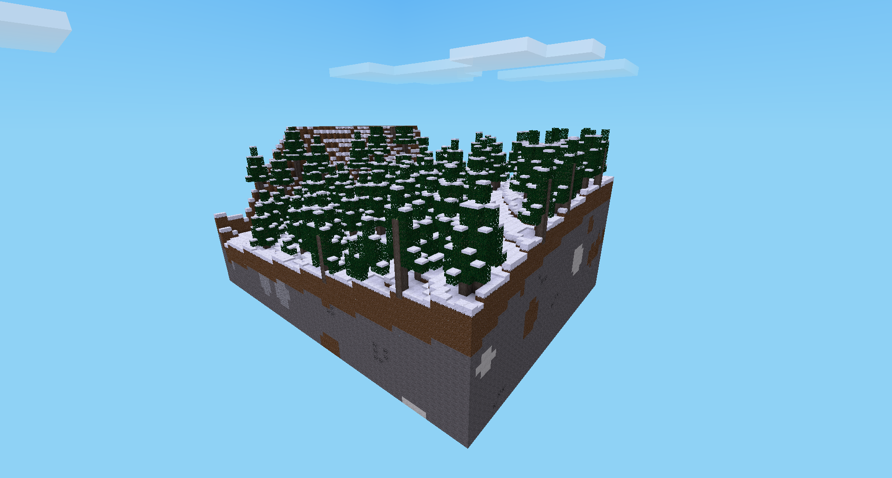

modgen mod for minetest


[](license.txt)
[](https://content.minetest.net/packages/BuckarooBanzay/modgen)

# Overview

Allows you to export a part of the map as a standalone mod which can be used as a mapgen

Api docs: https://buckaroobanzay.github.io/modgen/

Demo: https://github.com/BuckarooBanzay/mesecons_lab



Features:
* Map-as-a-mod export
* In-place saving after export
* Autosave
* Autoupdate map in already generated worlds

# Commands

* `/pos1`, `/pos2` Set opposite corners of the export map
* `/export [fast]` Exports the map as a standalone mod into `${worldfolder}/modgen_mod_export`
* `/modgen_stats` Returns some stats about the exported chunks and size
* `/autosave [on|off]` enables autosave feature (**warning**: may not work on some worldedit commands)

# In-place saving

After an initial mod-export the resulting mod can be edited live and in-place
if the `modgen` mod is also present (optional).

To enable the saving directly into the exported mod you have to add it to the "trusted_mods" setting:

```
secure.trusted_mods = modgen
```

Afterwards if you mark a region and execute `/export` the chunks are written to the exported mod itself

# Ignored nodes

Per default the `ignore` node is ignored from export/serialization (mapped to `air` internally)
If you want more nodes to be excluded from the resulting export you can add the group `modgen_ignore` to them:

```lua
minetest.register_node("mymod:mynode", {
  groups = {
    modgen_ignore = 1
  }
})
```

Or override a node from another mod:
```lua
minetest.override_item("other_mod:other_node", {
  groups = {
    modgen_ignore = 1
  }
})
```

# Autoupdate

You can provide updates to an already generated world if the following setting is
enabled in the import-mod/world settings:
```
import_mod.auto_update.enabled = true
```

This works by comparing the modified-time of the generated chunk (written in the mod-storage) with the mtime of the chunk in the import-mod.
The updated area will be deleted with `minetest.delete_area` and re-generated automatically.

# Technical notes

## Chunk export format

Chunks saved in `${import_mod}/map/chunk_${x}_${y}_${z}.bin`
```
1 byte:                       serialization version
1 byte:                       number of mapblocks in this chunk (#mapblocks)
4 bytes:                      modification time of this chunk
4096 * 2 * #mapblocks bytes:  node_ids of the mapblocks in (4096 * uint16) portions
4096 * #mapblocks bytes:      param1 data of the mapblocks
4096 * #mapblocks bytes:      param2 data of the mapblocks
remaining bytes:              chunk manifest in json format
```

## Chunk manifest

Json-file in the following format:
```json
{
  "mapblocks": [{
    "pos": {
      "x": 10,
      "y": -1,
      "z": 4
    },
    "has_metadata": true,
    "metadata": {
      "meta": {},
      "timers": {}
    }
  }],
  "mtime": 1649956501
}
```

**NOTE**: the `mapblocks[].pos` field references absolute world-positions in mapblocks

## Global manifest

Saved in `${import_mod}/manifest.json`

Json file that serves as an index to look up global infos:
* Amount of chunks and bytes saved
* Last modification time
* Node-ID mapping
* Max- and min-bounds of the chunks saved
* Modgen version used to save this map
* UID of the map (gets saved in the mod_storage of the world to prevent mod-misplacement)

```json
{
  "chunks" : 17,
  "mtime" : 1649956501,
  "next_id": 82,
  "node_mapping": {
    "access_cards:palm_scanner_off": 25,
    "air": 0,
    "default:chest": 53,
    "digilines:wire_std_00100000": 72
  },
  "bounds": {
    "min": {
      "x": 0,
      "y": 0,
      "z": 0
    },
    "max": {
      "x": 0,
      "y": 0,
      "z": 0
    }
  },
  "size" : 184548,
  "uid" : "970683",
  "version" : 3
}
```

## Export versions

Major versions with breaking changes:

* Version `1`: Initial release
* Version `2`: Reordered export axes from `x-y-z` to `z-x-y` (30% size decrease)
* Version `3`: Export whole chunks (50% size decrease)
* Version `4`: Manifest with easy accessible mtime info

To migrate between the major versions export everything into the world and re-import with the new version

## Testing

Requirements:
* Docker
* docker-compose

Usage:
```bash
docker-compose up --build
```

# License

* Code: MIT
* Textures: CC-BY-SA 3.0 (http://www.small-icons.com/packs/16x16-free-application-icons.htm)
